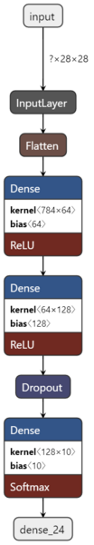

MNIST Handwritten Digit Recognizer
========================================================
author: Group B: Intelligex
date: 22/1/2022
autosize: false
right: 60%

 
 
 
 
 
 
Our shiny app is capable of recognizing handwritten digits.
The shiny app was published to [shiny Servers](http://yann.lecun.com/exdb/mnist/). The code can be also found on [Github](http://yann.lecun.com/exdb/mnist/).

***
 
 

This project is the result of the collaborative work of:

- Mujahed Yahia \- S2042189
- Muhammad Shaban \- S2038756
- Mohammad Yaqub \- S2107708
- Shahzeb Zoaib \- S2042057

Data Product Pipeline
========================================================
In the creation of this data product, the data science processing pipeline was carefully observed and followed.

1. Asking the question

2. Finding the data
  
3. Cleaning and Analysis

4. Modelling

The MNIST Dataset
========================================================

Lets take a look at the dataset

***
These are multiple images contained in the dataset. All images are of the same size 28 x 28 pixels.
 

It can be noticed that the same digit will vary in shape, so there isn't a rule that identifies the shape. That is where Machine Learning can help.  

[MNIST Dataset](http://yann.lecun.com/exdb/mnist/)

Training the Model
========================================================
left: 80%
The Machine Learning Model used here is 
This is the model's accuracy over the training period

With this model in hand, all we have to do is deploy it to Shiny
***

Conclusion & Shiny App Demo
========================================================
right: 60%
In the process of creating this app many obstacles were faced, our group efficiently and easily worked around them and continued the work.

With the now fully functional model deployed in shiny, we now have what is called a data product. This product can have many use cases.

*** 

Components of our shiny app:

- Home Page
  - Input, image inputted by the user
  - Output, the number that the model recognizes
- Documentation
  - Basic information on how to use our app, and how it functions.
- About our project
  - How this project can be used in real-life applications.
